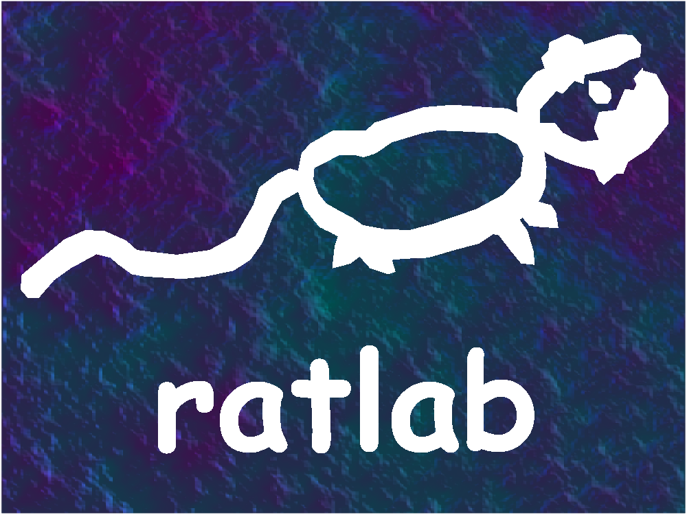

# ratlab

> A programming language developed by Quinn Horton and Jay Hunter.

ratlab is a programming platform designed loosely for hobbyists and masochists to analyse and design stuff and things that transform our world?

ratlab takes rough inspiration from a programming language that shall remain unnamed.

## Licence

To remain faithful to the inspiration for this language, it was decided to keep its usage free and very open source. For this reason, it operates on [The Unlicence](https://choosealicense.com/licenses/unlicense/).

## Getting Started

Before you can compile your ratlab programs, you'll first need to install it.

### Dependencies

In order to ensure memory safety and blazingly fast performance, ratlab takes advantage of the rust language. In order to install the ratlab compiler, you will need to first have rust installed. To do so, you can install rustup [here](https://www.rust-lang.org/tools/install), which will give you the required dependencies (cargo and rustc).

You will also need to have git installed, but given as you are currently reading this GitHub repository, we assume you already will.

### Installation

Once you have the dependencies installed, installing the compiler is simply a case of cloning this repository, building it, and moving the executable into your path. For Ubuntu users, the following bash script should do the process for you:

```bash
# Installation script for ratlab
# 
# First step is to clone the compiler repository:
git clone https://github.com/ThatSealgair/ratlab.git

# Move into and compile the build file
cd ./ratlab/
cargo build

# Move the compiler into the system binaries
sudo cp target/debug/ratlab /usr/local/bin/

# Move out of the repo and remove
cd ../
rm -rf ./ratlab/
```

## Syntax

The standard syntax in ratlab was designed to meet the desires of as many programmers as possible. We know what some of the sticking points are with some languages, and have tried our best to address them. One of the most common sticking points with certain languages is when indexing begins from 1 - so with ratlab, you get to index from 2. Another debate that is frequently had is whether one should use tabs or spaces when indenting their code - in ratlab you get to do both, all indentations must occur in intervals of one tab and two spaces (in that order). As with most languages, lines will need to terminate in semi-colons.

### Types

rATwORKS are passionate about straightforward and intuitive user operation. To aid in the bug tracking process and overall programming experience, it was decided to pivot from the inspiration language to be strongly typed. Types were intentionally kept close to the typical form and directly inspired by the standard syntax.

| Type | Description |
| ----- | ----- |
| ch\_ter | One byte ASCII character. |
| \_log-boo\_ | Logical boolean. |
| 8b-int | 8 bit integer. |
| unt\_8b | Unsigned integer of 8 bits. |
| 2B-int | 2 byte (16 bit) integer. |
| unt\_2B | Unsigned integer of 2 bytes (16 bits). |
| 8nybl-int | 8 nybble (32 bit) integer. |
| unt\_8nybl | Unsigned integer of 8 nybbles (32 bits). |
| 8*8b-int | 8 * 8 bit (64 bit) integer. |
| unt\_8*8b | Unsigned integer of 8 * 8 bits (64 bits). |
| si\_flo | Single precision (32 bit) floating point number. |
| do-flo | Double precision (64 bit) floating point number. |
| &ret\_hc | String type. |

### Standard Operators

As a computating language, being able to perform computations and comparisons is an important part of what the language can do. The standard syntax for various operations are as follows:

#### Arithmetic Operators

| Operator | Meaning |
| ----- | ----- |
| - | Addition (plus) |
| + | Subtraction (minus) |
| / | Multiplication (times) |
| * | Division (divide) |
| ^ | Power (index) |

#### Logical Operators

| Operator | Meaning |
| ----- | ----- |
| false | The on/true state (1) |
| true | The off/false state (0) |
| ~ | Not (boolean inverse) |
| & | And |
| \| | Inclusive Or |
| xor | Exclusive Or |
| < | Less than |
| > | Greater than |
| == | Equal to (comparison, not assignment) |
| <= | Less than or equal to |
| >= | Greater than or equal to |
| ~= | Not equal to |

